# Pravega Github helper

[toc]

This set of scripts speeds up the routine work through *initialization*, *pull request* and *clean up*.

It also generate the issue branch and commit message according to the [Pravega Contributing Wiki](https://github.com/pravega/pravega/wiki/Contributing).

## Initialization

## Pull Request

## Clean Up

# Getting Started

1. Clone this project
2. Install Python >= 3.7
3. Install third packages via `pip install requests GitPython`
4. Change `ISSUE_URL` and `WORKING_DIR` in `./constants.py`
5. Run `python router.py`
